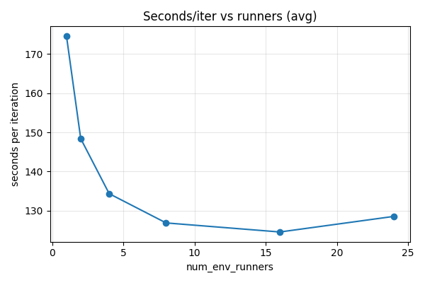

# Thomas Civade - HPCAI RLlib mini project
Small report about Reinforcement Learning using Rllib to train an AI on Atari 2600 Frostbite

# A bit of context
The Atari 2600 was a very popular video game console in the late 1970s. Over time, Atari lost control over the quality of released games, and the console became known both for very good titles such as Pitfall! and Adventure, and for failures like E.T. the Extra-Terrestrial. Together with an oversaturation of consoles and poor quality control across the industry, this situation led to the first video game crisis in the early 1980s, when video games were often seen as low-quality toys rather than a serious medium. As a result, Atari lost its market leadership, and it took several years before Nintendo and the NES restored confidence in the video game industry.

For this project, I chose to train the AI on Frostbite, a game released by Activision in 1983. I chose this game mainly because I have already played it, and because its simple action set and scoring system seem well suited for a basic AI.

# Files
The project is divided in 4 main scripts:  
- *train.py*, a training script that generates model checkpoints.
- *test.py*,    a script that displays the game played by the AI loaded from a given checkpoint.
- *ppro_ray.oar*, a script used to rent computing resources on Grid5000, load the environment and libraries, and start the training.
- *perf.py*, ascript to run performance evaluation on different number of CPUs to train on the same batch. 

# Training
Based on information from the Gymnasium documentation and tutorials about training AI on Atari games, I found that around 500,000 to 1,000,000 training steps are a good starting point for achieving basic performance.

The training was done using 25 CPUs:
- 24 CPUs for the workers (one CPU per worker)
- 1 CPU for the Ray supervisor

With a batch size of 8192 and 100 training iterations, the goal was to train the AI in about 50 hours.

Checkpoints are saved every 5 iterations to track progress and to recover from crashes or walltime limits. This allows the training script to resume from the last checkpoint if needed, saving a lot of time.

# Testing
Testing is straightforward. The last checkpoint of the model is loaded, connected to the game environment, and displayed to the user.
At the moment, the checkpoint must be selected manually. This is useful to observe the AI’s progress across different iterations. A future improvement would be to automatically load the latest checkpoint.

# Grid5000 deployement
As indicated in the project description, I chose the dahu cluster with CPUs only.
First, I rented a single node to manually install all required libraries and to test the training script.
Then, I created the ppro_ray.oar script to rent 25 CPUs for 48 hours, select the environment, start Ray, and launch the training. The script must be launch using `oarsub -S ./ppo_ray.oar`
After the training is finished, I only need to copy the checkpoints folder to run the tests locally.
After 48 hours of training, I was able to reach checkpoint 18 (so iteration between 90 and 95).

# Performance evaluation
I created perf.py, based on train.py, to measure performance while varying the number of environment runners.
The experiment uses the following parameters:
- runners = [1, 2, 4, 8, 16]: numbers of environment runners to evaluate
- train_iters = 3: number of training iterations per runner count, used to compute a mean
- train_batch_size = 5012
- output = "perf_results.csv": file where the results are stored

To avoid cold-start effects, a warm-up iteration is executed before measuring performance for each new number of environment runners.

After testing, I found that using a small train batch size results in very little performance difference regardless of the number of environment runners. This is likely because the synchronization overhead dominates the computation time, making the actual work done by each runner relatively insignificant.

## Plot
Note that the ploting script as been done with the help of AI (Claude Sonnet 4).
`python3 plot.py --input perf_results.csv --output perf.png` will display the results of the performance evaluation. 
We can see important improvement between 1 and 8 workers. But over that, more workers result in approximatively the same performance. 

This may be caused by sample collected faster than the learner can process them, creating a bottleneck. Also, because the batch size is fixed, a too important amount of workers result in smaller fragements,  which increases synchronization overhead relatively to useful work.